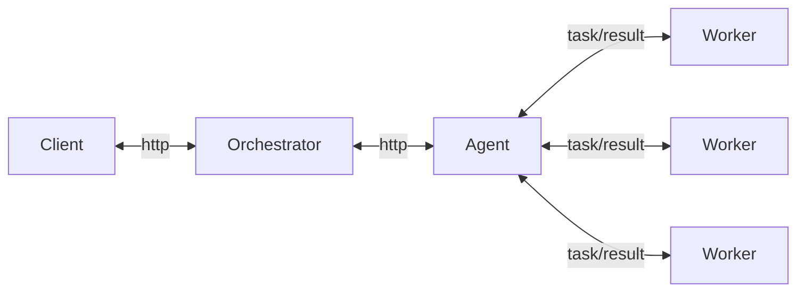

# Ведутся работы...
пока что версия ридми старая, со 2 финалки, в течение ночи появится новая)

<a id="about"></a>
## About 👀
Веб-сервис для распределенного вычисления арифметических выражений. Состоит из:
- **Оркестратора** (далее - сервера), который предоставляет API, принимает выражения и обеспечивает порядок их выполнения
- **Агента**, принимающего задачи от Оркестратора и производящего параллельные вычисления путем запуска пула воркеров

Калькулятор поддерживает операции сложения, вычитания, умножения и деления, а также операции приоретизации и унарные операции

## Содержание 📜
- [About](#about)
- [Структура проекта](#структура-проекта)
- [How it works](#how-it-works)
- [Orchestrator API](#orchestrator-api)
- [Agent](#agent)
- [Переменные окружения](#переменные-окружения)
- [Quick start](#quick-start)
- [Examples](#examples)
- [Другие особенности проекта](#другие-особенности-проекта)
- [Контакты](#contacts)

<a id="структура-проекта"></a>
## Структура проекта 🚧
```
сmd
  - agent
    -- main.go       // запуск агента
  - server
    -- main.go       // запуск оркестратора
internal
  - agent
    -- agent.go           // инициализация агента
    -- errors.go          // ошибки агента
    -- http.go            // запросы, которые выполняет агент
    -- http_test.go       // тесты для веб-запросов
    -- process.go         // обработка арифметических операций
    -- worker.go          // логика воркера (параллельно работающего вычислителя)
    -- worker_test.go     // тесты для воркера
  - entities
    -- storage.go         // сущности хранилища
  - logger
    -- logger.go          // инициализация логгера (zap)
  - server
    -- handlers.go        // обработчики для сервера
    -- server.go          // инициализация оркестратора
    -- storage.go         // инициализация хранилища и методы для работы с ним
web
  - index.html            // веб-интерфейс
pkg
  - calculation
    -- calculation.go      // логика вычислений
    -- calculation_test.go // тесты для вычислений
    -- errors.go           // ошибки вычислений
.env    // переменные окружения
```
<a id="how-it-works"></a>
## How it works 🎯
Сервер по умолчанию запускается на порту `:8081`. Он предоставляет API для взаимодействия с клиентом и агентом, принимает арифметическое выражение, переводит его в набор последовательных задач и обеспечивает порядок их выполнения. 
Агент может получить от оркестратора задачу, выполнить ее и вернуть серверу результат. Он запускает пул воркеров, которые параллельно выполняют задачи, получаемые от оркестратора.

<a id="orchestrator-api"></a>
## Orchestrator API 👷
- **Добавление вычисления арифметического выражения**: `/api/v1/calculate` - **POST**
  
**Запрос**:
```json
{
    "expression": "строка с выражением"
}
```
**Ответ**:
```json
{
    "id": "присвоенный идентификатор"
}
```
**Коды** ответа:
-  - выражение принято для вычисления
-  - ошибка синтаксиса
-  - невалидные данные
-  - ошибка на сервере
---

- **Получение списка выражений**: `/api/v1/expressions` - **GET**

**Ответ**:
```json
{
    "expressions": [
        {
            "id": "идентификатор выражения",
            "expression": "принятое выражение",
            "status": "статус вычисления выражения",
            "result": "результат выражения"
        },
        {
            "id": "идентификатор выражения",
            "expression": "принятое выражение",
            "status": "статус вычисления выражения",
            "result": "результат выражения"
        }
    ]
}
```
**Коды** ответа:
-  - список получен
-  - ошибка на сервере
  
Отмечу, что выражение может находится в **4 состояниях**:
1. Принято - Accepted
2. В работе - In progress
3. Выполнено - Сompleted
4. Выполнено, но с ошибкой - Сompleted with error
---

- **Получение выражения по идентификатору**: `/api/v1/expressions/:id` - **GET**

**Ответ**:
```json
{
    "expression":
        {
            "id": "идентификатор выражения",
            "expression": "принятое выражение",
            "status": "статус вычисления выражения",
            "result": "результат выражения"
        }
}
```
**Коды** ответа:
-  - список получен
-  - выражения не существует
-  - ошибка на сервере
---

- **Получение задачи для выполнения**: `/api/v1/task` - **GET**

**Ответ**:
```json
{
    "task":
        {
            "id": "идентификатор задачи",
            "arg1": "первый аргумент",
            "arg2": "второй аргумент",
            "operation": "операция"
        }
}
```
**Коды** ответа:
-  - задача получена
-  - задач нет
-  - ошибка на сервере
---

- **Прием результата обработки**: `/api/v1/task` - **POST**

**Ответ**:
```json
{
    "task":
        {
            "id": "идентификатор задачи",
            "result": "результат задачи",
            "error": "ошибки вычисления",
        }
}
```
**Коды** ответа:
-  - результат записан
-  - невалидные данные
-  - ошибка на сервере


<a id="agent"></a>
## Agent 🕶️
Агент запускает пул воркеров, принимает задачи, вычисляет их параллельно и возвращает результат обратно на сервер. Схематически можно изобразить работу системы подобным образом:

Время, которое воркер тратит на выполнение операции задается с помощью **переменных окружения** 👇

<a id="переменные-окружения"></a>
## Переменные окружения 📩
```env
SERVER_PORT=8081       // порт оркестратора   

TIME_ADDITION_MS=5000            // операция сложения
TIME_SUBTRACTION_MS=5000         // операция вычитания
TIME_MULTIPLICATIONS_MS=10000    // операция умножения
TIME_DIVISIONS_MS=10000          // операция деления
COMPUTING_POWER=8                // количество воркеров агента
```
При желании вы можете изменить переменные в файле `.env`, так как они читаются именно оттуда. Конфигурации агента и сервера предусматривают также переменные по умолчанию

<a id="quick-start"></a>
## Quick start ⚡
**1. Склонируйте проект**
```shell
git clone https://github.com/YattaDeSune/calc-project.git
cd calc-project
```

**2. Установите зависимости**
```shell
go mod tidy
```

**3. Запустите Оркестратора и Агента**
```shell
go run cmd/server/main.go
go run cmd/agent/main.go
```
Запускать их необхлдимо в разных терминалах: сначала Сервер, а потом Агент. После этого сервер запустится на порту `:8081` по умолчанию

4. При желании запустие 🟢**веб-интерфейс**🟢, открыв файл `web/index.html` в любом браузере. С его помощью вы сможете легко посылать новые задачи, а также запрашивать старые
- **ВАЖНО!** Веб интерфейс посылает запросы на порт `:8081`, поэтому убедитесь, что оркестратор запущен именно на нем

Готово, теперь вы можете посылать запросы Оркестратору! (Через веб-интерфейс, POSTMAN, curl итд.) Далее рассмотрим примеры запросов с помощью `curl`

<a id="examples"></a>
## Examples 🔴
**1. /calculation** - успешный ответ

**Запрос**:
```
curl --location 'localhost:8081/api/v1/calculate' \
--header 'Content-Type: application/json' \
--data '{
  "expression": "2+2*2.2"
}'
```
**Ответ**:
```json
  {"id":1}
```
Статус **код** - 

---

**1.2. /calculation** - неверные данные запроса

**Запрос**:
```
curl --location 'localhost:8081/api/v1/calculate' \
--header 'Content-Type: application/json' \
--data '{
  "hello": "2+2*2"
}'
```
**Ответ**:
`Expression cannot be empty`
Cтатус **код** - 

---

**2. /expressions** - успешный ответ

**Запрос**:
`curl --location 'localhost:8081/api/v1/expressions'`
**Шаблон ответа**:
```
{
  "expressions":
    [
      {"id":1,"expression":"2ad+2*2","status":"completed with error","result":"expression is not valid"},
      {"id":2,"expression":"2+2*2.2","status":"in progress","result":null},
      {"id":3,"expression":"2+2","status":"completed","result":4}
    ]
}
```
Cтатус **код** - 
Иной ответ можно получить только при ошмбке на стороне сервера

---

**3. /expression/:id** - успешный ответ

**Запрос**:
`curl --location 'localhost:8081/api/v1/expressions/1'`
**Шаблон ответа** (при условии что выражение с id 1 существует):
```
{
  "expression":{"id":1,"expression":"2+2*2.2","status":"completed","result":6.4}
}
```
Cтатус **код** - 

---

**3.2. /expression/:id** - нет такого выражения

**Запрос**:
`curl --location 'localhost:8081/api/v1/expressions/aboba'`
**Ответ**: 
`Invalid ID`
Cтатус **код** - 

---
Взаимодействие Оркестратора и Агнета в примерах рассматривать мы не будем, так как необходимости в этом нет :)

<a id="другие-особенности-проекта"></a>
## Другие особенности проекта 🐯
- **Оркестратор** использует в качестве хранилища слайс, задачи для каждого выражения хранятся в виде слайса в самом выражении. Разбиение на задачи происходит **последовательно** с помощью Обратной польской нотации
- **Логгирование** в проекте реализовано с помощью логгера **zap**. Экземпляр логгера создается в `main.go` файлах. В Агенте он передается через контекст, а в Оркестраторе он является полем структуры
- Для Агента и Сервера реализован **Graceful shutdown** с помощью контекста и обработки системных сигналов
- **Переменные окружения** загружаются из файла `.env`, который находится в корне проекта. Но если такой файл отсутствует, конфиги Агента и Оркестратора загрузят значения по умолчанию

<a id="contacts"></a>
## Contacts 💬
<div id="contacts">
  <a href="https://t.me/YattaDesuNe">
    
  </a>
  <a href="mailto:belyaevlv742@gmail.com">
    
  </a>
</div>

