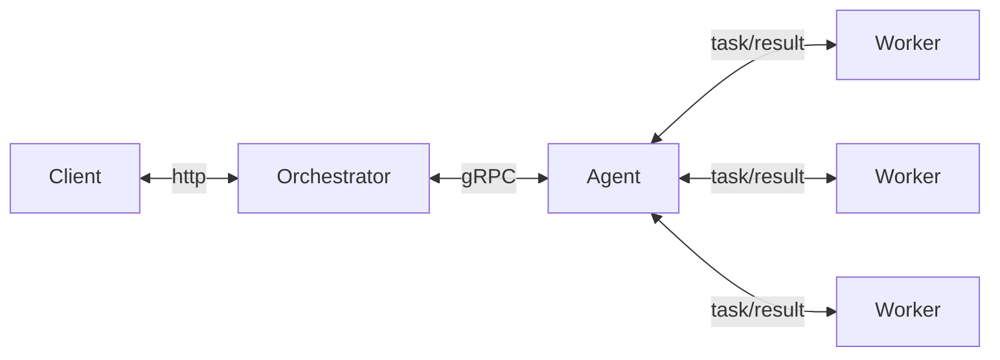
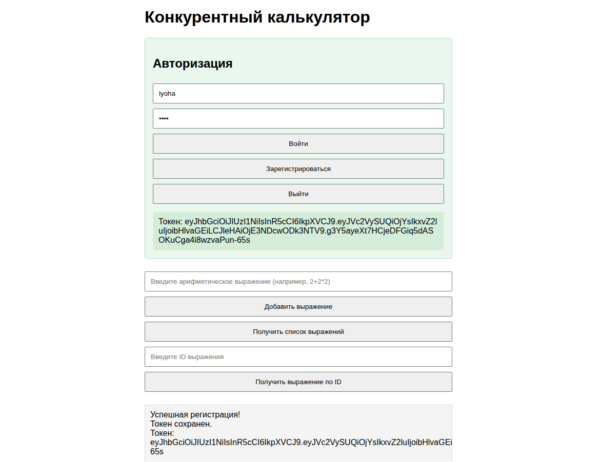

<a id="about"></a>
## About 👀
Веб-сервис для распределенного вычисления арифметических выражений. Состоит из:
- **Оркестратора** (далее - сервера), который предоставляет REST API, принимает выражения и обеспечивает порядок их выполнения
- **Агента**, принимающего задачи от Оркестратора и производящего параллельные вычисления путем запуска пула воркеров
Сервисы общаются между собой по **gRPC**

- Калькулятор поддерживает операции сложения, вычитания, умножения и деления, а также операции приоретизации и унарные операции.
- Реализует многопользовательскую систему с **JWT-авторизацией**.
- Данные хранятся локально в **БД sqlite** (при перезагрузке системы данные сохраняются).

## Содержание 📜
- [About](#about)
- [Структура проекта](#структура-проекта)
- [How it works](#how-it-works)
- [Orchestrator API](#orchestrator-api)
- [Agent](#agent)
- [Переменные окружения](#переменные-окружения)
- [Общение сервисов](#общение-сервисов)
- [Quick start](#quick-start)
- [Examples](#examples)
- [Другие особенности проекта](#другие-особенности-проекта)
- [Контакты](#contacts)

<a id="структура-проекта"></a>
## Структура проекта 🚧
```
сmd
  - agent
    -- main.go            // запуск агента
  - server
    -- main.go            // запуск оркестратора
internal
  - agent
    -- agent.go           // инициализация агента
    -- errors.go          // ошибки агента
    -- process.go         // обработка арифметических операций
    -- worker.go          // логика воркера (параллельно работающего вычислителя)
    -- worker_test.go     // тесты для воркера
  - auth
    -- jwt.go             // методы и сущности для jwt-авторизации
  - db
    - sqlite.go           // методы для работы с БД
  - entities
    -- storage.go         // сущности хранилища
    -- contextkeys.go     // ключи для извлечения данных из контекста
  - logger
    -- logger.go          // инициализация логгера (zap)
  - middleware
    -- accesslog.go       // логгирование запросов
    -- auth.go            // аунтефикация при запросе
    -- cors.go            // для работы веб-интефеса
    -- panic.go           // ловим панику (или Анику)
  - proto
    -- task.proto         // описание gRPC сообщений
    + сгенерированные файлы
  - server
    -- handlers.go        // обработчики для сервера
    -- server.go          // инициализация оркестратора
    -- storage.go         // инициализация хранилища и методы для работы с ним
web
  - index.html            // веб-интерфейс (!!! очень рекомендую к использованию !!!)
pkg
  - calculation
    -- calculation.go      // логика вычислений
    -- calculation_test.go // тесты для вычислений
    -- errors.go           // ошибки вычислений
.env                       // переменные окружения
calculator.db              // БД, появится при первом запуске Оркестратора
```
<a id="how-it-works"></a>
## How it works 🎯
Сервер по умолчанию запускается на порту `:8081` (gRPC для общения сервисов - на `:9090`). Он предоставляет API для взаимодействия с клиентом, принимает арифметическое выражение, переводит его в набор последовательных задач и обеспечивает порядок их выполнения. 
Агент может получить от оркестратора задачу, выполнить ее и вернуть серверу результат (еще раз напомню - по gRPC :) ). Он запускает пул воркеров, которые параллельно выполняют задачи, получаемые от оркестратора.

Перед тем, как начинать вычиления, пользователь должен зарегестрироваться (реализовано на JWT).

<a id="orchestrator-api"></a>
## Orchestrator API 👷
- **Регистрация**: `/api/v1/register` - **POST**

**Запрос**:
```json
{
    "login": "строка с логином",
    "password": "пароль"
}
```
**Ответ**:
```json
{
    "token": "jwt-токен"
}
```
**Коды** ответа:
-  - успешная регистрация
-  - ошибка синтаксиса
-  - ошибка на сервере
---

- **Авторизация**: `/api/v1/login` - **POST**

**Запрос**:
```json
{
    "login": "строка с логином",
    "password": "пароль"
}
```
**Ответ**:
```json
{
    "token": "jwt-токен"
}
```
**Коды** ответа:
-  - успешный вход
-  - ошибка синтаксиса
-  - неверный пароль
-  - неверный пользователь
-  - ошибка на сервере
---

- **Добавление вычисления арифметического выражения**: `/api/v1/calculate` - **POST**
  
**Запрос**:
```json
{
    "expression": "строка с выражением"
}
```
**Ответ**:
```json
{
    "id": "присвоенный идентификатор"
}
```
**Коды** ответа:
-  - выражение принято для вычисления
-  - ошибка синтаксиса
-  - невалидные данные
-  - ошибка на сервере
---

- **Получение списка выражений**: `/api/v1/expressions` - **GET**

**Ответ**:
```json
{
    "expressions": [
        {
            "id": "идентификатор выражения",
            "expression": "принятое выражение",
            "status": "статус вычисления выражения",
            "result": "результат выражения"
        },
        {
            "id": "идентификатор выражения",
            "expression": "принятое выражение",
            "status": "статус вычисления выражения",
            "result": "результат выражения"
        }
    ]
}
```
**Коды** ответа:
-  - список получен
-  - ошибка на сервере
  
Отмечу, что выражение может находится в **4 состояниях**:
1. Принято - Accepted
2. В работе - In progress
3. Выполнено - Сompleted
4. Выполнено, но с ошибкой - Сompleted with error
---

- **Получение выражения по идентификатору**: `/api/v1/expressions/:id` - **GET**

**Ответ**:
```json
{
    "expression":
        {
            "id": "идентификатор выражения",
            "expression": "принятое выражение",
            "status": "статус вычисления выражения",
            "result": "результат выражения"
        }
}
```
**Коды** ответа:
-  - список получен
-  - выражения не существует
-  - ошибка на сервере
---

<a id="agent"></a>
## Agent 🕶️
Агент запускает пул воркеров, принимает задачи, вычисляет их параллельно и возвращает результат обратно на сервер. Схематически можно изобразить работу системы подобным образом:

Время, которое воркер тратит на выполнение операции задается с помощью **переменных окружения** 👇

<a id="переменные-окружения"></a>
## Переменные окружения 🗺️
```env
HTTP_SERVER_PORT=8081            // порт оркестратора для http
GRPC_SERVER_PORT=9090            // порт оркестратора для gRPC

TIME_ADDITION_MS=5000            // операция сложения
TIME_SUBTRACTION_MS=5000         // операция вычитания
TIME_MULTIPLICATIONS_MS=10000    // операция умножения
TIME_DIVISIONS_MS=10000          // операция деления
COMPUTING_POWER=8                // количество воркеров агента
```
При желании вы можете изменить переменные в файле `.env`, так как они читаются именно оттуда. Конфигурации агента и сервера предусматривают также переменные по умолчанию

<a id="общение-сервисов"></a>
## Общение сервисов 📩
В директории `proto` описано взаимодействие сервисов: они обмениваются информацией о "тасках" между собой с помощью `gRRC`: 
- Агент ждет (постоянно слушает), когда у сервера появляется новая задача на вычисление
- Когда задача появилась, агент забирает ее на обработку
- После обработки таска улетает обратно серверу

<a id="quick-start"></a>
## Quick start ⚡
**1. Склонируйте проект**
```shell
git clone https://github.com/YattaDeSune/calc-project.git
cd calc-project
```

**2. Установите зависимости**
```shell
go mod tidy
```

**3. Запустите Оркестратора и Агента**
```shell
go run cmd/server/main.go
go run cmd/agent/main.go
```
Запускать их необходимо в разных терминалах: сначала Сервер, а потом Агент. После этого сервер запустится на портах `:8081` для http и `:9090` для gRPC по умолчанию.

4. !**ОЧЕНЬ РЕКОМЕНДУЕТСЯ** использовать 🟢**веб-интерфейс**🟢, открыв файл `web/index.html` в любом браузере. С его помощью вы сможете:
- регестрироваться и отслеживать текущий токен
- легко посылать новые задачи, а также запрашивать старые

**ВАЖНО!** Веб интерфейс посылает запросы на порт `:8081`, поэтому убедитесь, что оркестратор (http) запущен именно на нем.

Готово, теперь вы можете посылать запросы Оркестратору! (Через веб-интерфейс, POSTMAN, curl итд.) Далее рассмотрим примеры запросов с помощью `curl`

<a id="examples"></a>
## Example 🔴
Рассмортим пример, используя **веб-интерфейс**


---

<a id="другие-особенности-проекта"></a>
## Общие особенности проекта 🐯
- Реализуется многопользовательская система с **JWT-авторизацией**
- Данные хранятся локально в **БД sqlite** (при перезагрузке системы данные сохраняются)
- **Оркестратор** использует в качестве хранилища на время вычисления выражения мапу. Разбиение на задачи происходит **последовательно** с помощью Обратной польской нотации
- **Логгирование** в проекте реализовано с помощью логгера **zap**. Экземпляр логгера создается в `main.go` файлах. В Агенте он передается через контекст, а в Оркестраторе он является полем структуры
- Для Агента и Сервера реализован **Graceful shutdown** с помощью контекста и обработки системных сигналов. Общаются сервисы по **gRPC**
- **Переменные окружения** загружаются из файла `.env`, который находится в корне проекта. Но если такой файл отсутствует, конфиги Агента и Оркестратора загрузят значения по умолчанию

<a id="contacts"></a>
## Contacts 💬
<div id="contacts">
  <a href="https://t.me/YattaDesuNe">
    
  </a>
  <a href="mailto:belyaevlv742@gmail.com">
    
  </a>
</div>

